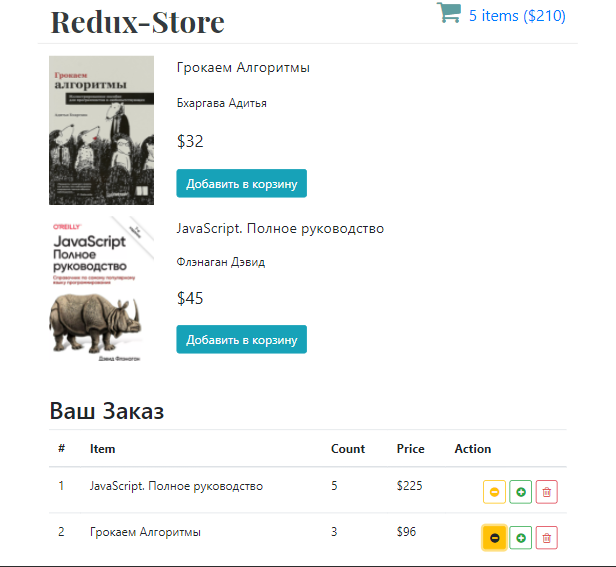
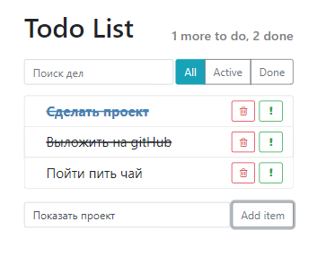

# Структура
В папке `"Теория"` - содержатся тезисы/заметки/конспекты сделанные во время самостоятельного обучения.

В папке `"Учебные_проекты"` - содержатся проект в разной степени готовности, которые использовались для технического роста.

## Проекты: подробности и код внутри папок
## 1) Redux-Store

Технологии: `React / React-Redux / React-Router / SCSS / Bootstrap`

### Функционал
1) Роутинг по страницам
2) Загрузка комонентов: Loader - пока идет запрос на сервер, Error - в случае ошибки сервера
3) Добавление книг в список покупок
4) Увеличение/уменьшение/удаление значений в списке покупок

## 2) React: ToDo-List

Технологии: `React / SCSS / Bootstrap`

### Функционал
1) Удаление/Добавление дел в список;
2) Компонент "Строка поиска по делам";
3) Пометка о важности, выполненности дел;
4) Отображение счетчика количества оставшихся дел;
5) Компонент "Фильтра" по статус дел;

## 3) # Star Wars UI-Data-Base

Технологии: `React / React-Router / SCSS / Bootstrap`

### Функционал
1) Визуальное отображение данных, детальные данные выбранного элемента списка;
2) Запросы к реальному server-API, микросервис;
3) Переключение страниц - 2 вида:
- 1 Лишь визуальное отображение;
- 2 Сохранение данных при перезагрузке и копировании url;
4) Переодическая смена отображемого компонента Планеты;
