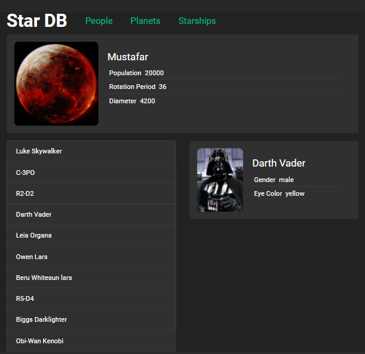
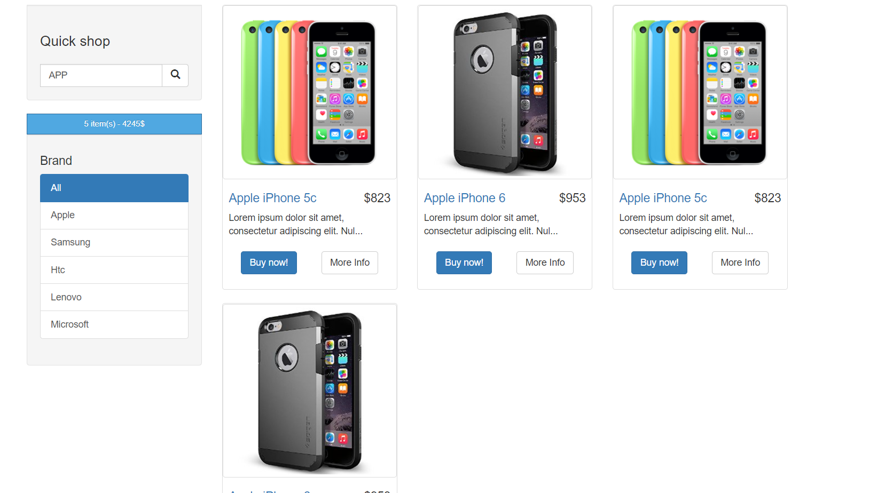

# Структура
В папке `"Теория"` - содержатся тезисы/заметки/конспекты сделанные во время самостоятельного обучения.

В папке `"Учебные_проекты"` - содержатся проект в разной степени готовности, которые использовались для технического роста.

#### Проекты: подробности и код внутри папок репозитория
#### 1. ToDo-List 

Технологии: `React / SCSS / Bootstrap`

#### Функционал
- Удаление/Добавление дел в список;
- Компонент "Строка поиска по делам";
- Пометка о важности, выполненности дел;
- Отображение счетчика количества оставшихся дел;
- Компонент "Фильтра" по статус дел;

#### 2. Star Wars UI-Data-Base

Технологии: `React / React-Router / SCSS / Bootstrap`

#### Функционал
- Визуальное отображение данных, детальные данные выбранного элемента списка;
- Запросы к реальному server-API;
- Переключение страниц - 2 вида:
  - Лишь визуальное отображение;
  - Сохранение данных при перезагрузке и копировании url;
- Переодическая смена отображемого компонента Планеты;

#### 3. Redux-Store

Технологии: `React / React-Redux / React-Router / SCSS / Bootstrap`

#### Функционал
- Роутинг по страницам
- Загрузка комонентов: Loader - пока идет запрос на сервер, Error - в случае ошибки сервера
- Добавление книг в список покупок
- Увеличение/уменьшение/удаление значений в списке покупок

#### 4. React-Redux internet-shop

Технологии: `React / React-Router / React-Redux / Bootstrap`

#### Функционал
- Роутинг по страницам
- Пагинация - загрузка новых данных по клику на кнопку "Load More" из mock-данных
- Страница отдельного товара
- Виджет корзины
- Функционал поиска
- Выбор категории товара
- Страница и функционал корзины, подготовка данных к отправке на сервер
